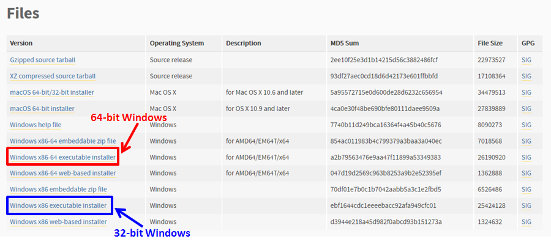
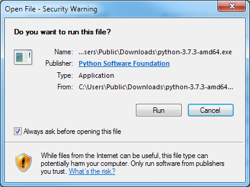
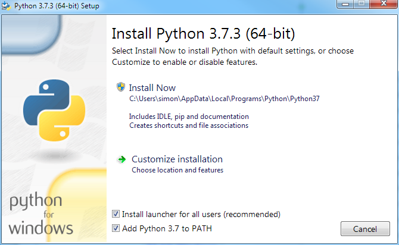
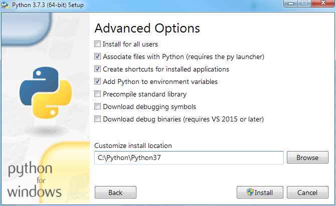
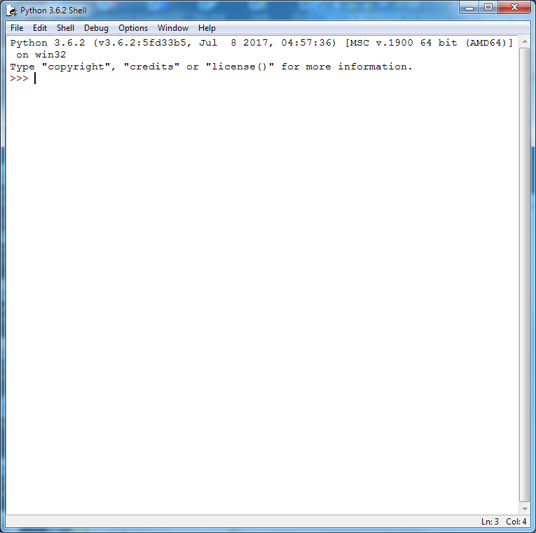

## Instructions for installing Python on a Windows computer

### 1. Find out if your Windows Operating System is 32-bit or 64-bit

It is important to know this before choosing which Python file to download from the internet.

*Windows 7:* 

Press the Windows key, then type "Control Panel". From the list of possible options click on Control Panel.

When the Control Panel opens if there is an item called "System" then click on this. 

If there isn't an icon called "System" but there is a category called "System and Security" then click on this then click on "System" in the new display.

For Windows 7 the display will look like this:

The item labelled "System type:" will show you whether your operating system is 32-bit or 64-bit.

*Windows 8 or 10:* 

Press the Windows key, then type "Control Panel". From the list of possible options click on Control Panel Desktop App.

When the Control Panel opens if there is an item called "System" then click on this. 

If there isn't an icon called "System" but there is a category called "System and Security" then click on this then click on "System" in the new display.

The display will look very similar to the Windows 7 display shown above.

The item labelled "System type:" will show you whether your operating system is 32-bit or 64-bit.

### 2. Go to the Python Releases for Windows download web page

Click on this link to go to the Python download page. The best option is to hold down the Ctrl key while clicking. This will open the Python page in a new tab and leave these instructions available to go back to.

[https://www.python.org/downloads/windows/](https://www.python.org/downloads/windows/)

Here is what the link looks like:

From the two options at the top of the page select the one called "Latest Python 3 Release"

In this example the latest Python version is 3.7.3, but this might be different if you download Python at a later time.

The link will go to a page which looks like this (again, the version number might not be 3.7.3):

Scroll down until you find a section headed **Files**

Choose the file depending on whether your operating system is 32-bit or 64-bit and click on the link. The file will either start downloading straight away into your Downloads folder, or you may be asked where on your computer you want to save the file. Choose where to save it, then click OK.

### 3. Run the installation program

Open Windows Explorer (if you have Windows 7) or File Explorer (if you have Windows 8 or 10) and navigate to the place where the Python installation file has been saved. Double click on this file to start the installation.

You will probably see a window like this:

Click Run. This will open the first Set up window:

Make sure there is a tick in the box labelled "Add Python to PATH". (You might have to click in this box.)

Then click on Customize installation. This will open the second Set up window:

There is nothing to be changed on this page, so click Next to open the third Set up window:

When this window opens it will probably show the Customize install location as C:\Users\<your name>\AppData...\Python37

We strongly recommend changing this to C:\Python\Python37

(Note: if you are installing a later version of Python the number 37 might be replaced with a higher number.)

Once you have changed to install location click on Install. This will probably open a window like this:

Click on Yes to complete the Python installation. This may take a few minutes.

### 4. Open the Python IDLE editor

Once the installation is finished click on the Windows key. Type the word Python, and it should find a program called IDLE (with the Python version in brackets after it).

Click on this to open up the Python Shell window:

You are now ready to start experimenting with Python!

