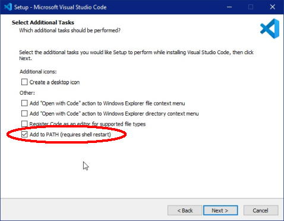
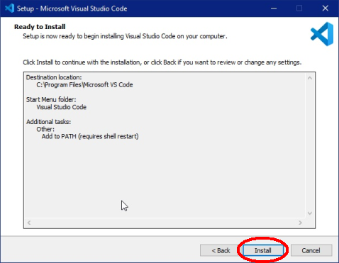
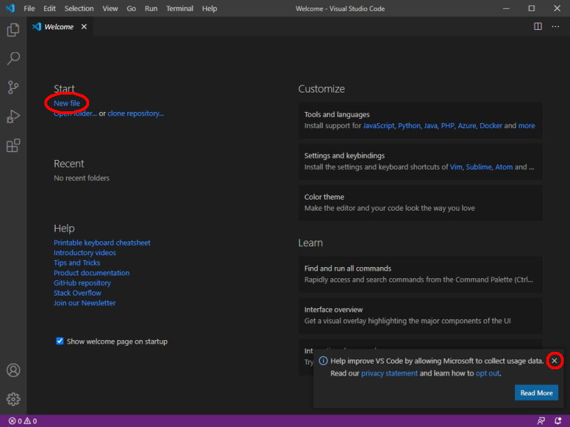
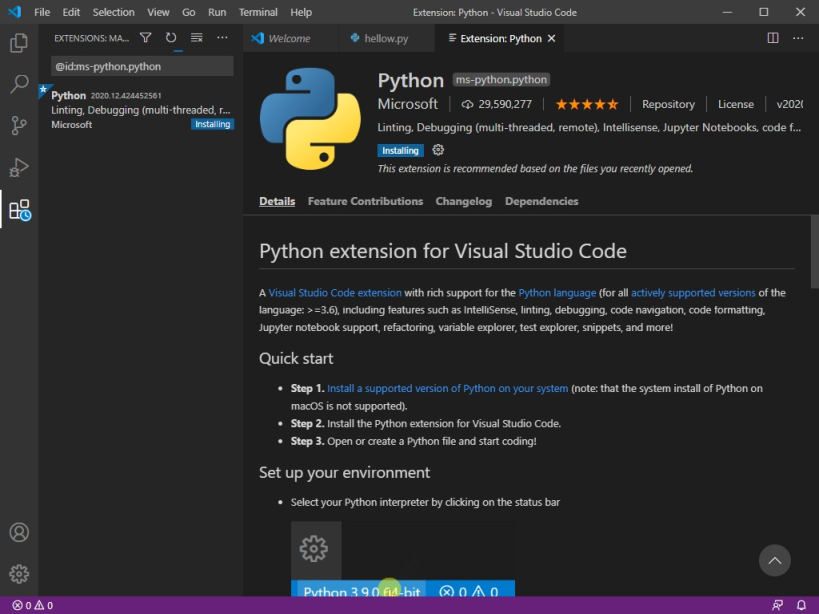
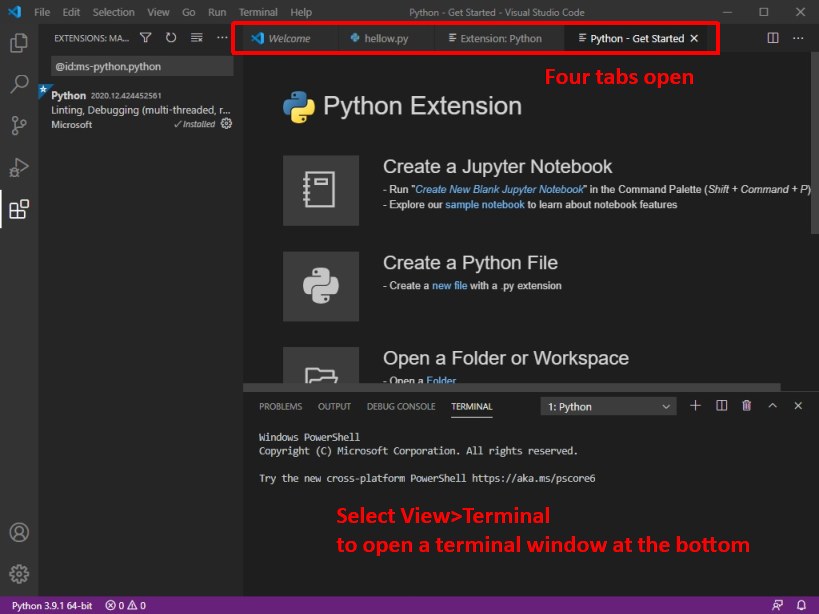
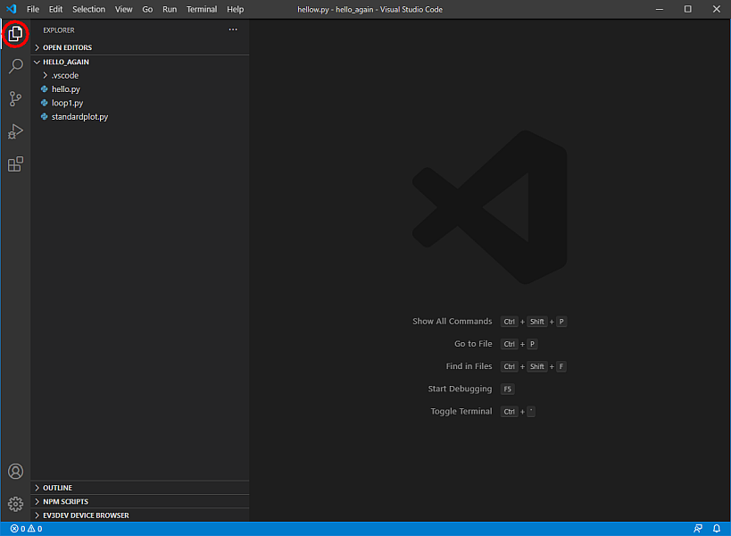
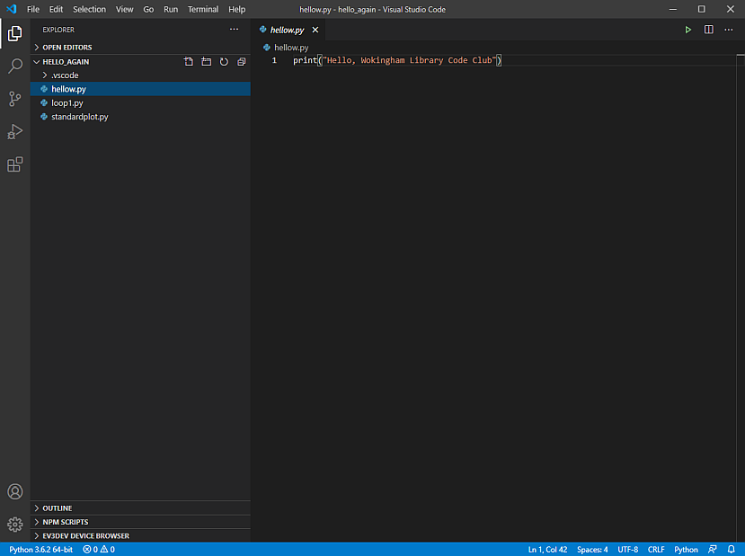

# Installing and Using *Visual Studio Code*

We have sometimes abbreviated *Visual Studio Code* to *VSC* in this page.

## Installing the *Visual Studio Code* editor

How to find, download and install the latest version of *Visual Studio Code*:

* Go to the [download page](https://code.visualstudio.com/#alt-downloads)


and select the version for your operating system.

For Windows you should know from doing the Python installation whether your system is 32-bit or 64-bit. Choose **User Installer** if you are the only user on your computer, or if other users don't want to use *Visual Studio Code*; choose **System Installer** if you want all users on your computer to be able to use *Visual Studio Code*.

Save the downloaded file to your computer, and double-click on the file to run the installation.

The following images show the sequence of dialogue boxes which appear. click on the *Next* button to go to the next stage.




Make sure there is a tick in the box for "Add to PATH"



Click on *Install* to start the process.

## Setting up *Visual Studio Code*

After a while *Visual Studio Code* Welcome page will open.



Select "New File" to open a file to write Python code in.


The new file will be called "Untitled-1".


Open File>Save As to save your file in a place where you keep your Python files.


When you *save* your file you need to look at the options in the box "Save as type" and select "Python". This will ensure your file has the extension ```.py```, so that *VSC* knows it is Python code.


When *VSC* recognises you are writing code in Python it will ask if you want to install the recommended extensions for Python. Choose "Install". This window appears while the extension is loading:







Watch the introductory video at
* [https://code.visualstudio.com/docs/introvideos/basics](https://code.visualstudio.com/docs/introvideos/basics)

which shows you the programme window and gives an example of writing Python code in the editor.

## Using *Visual Studio Code*

When you are creating your own Python projects you will find it is a very good plan to create a *separate folder* for each project you work on. In the project folder you can put any Python code you write, but also images or sound files as well as any other background information which helps you with your project.

If you have your Python project in its own folder there is a *very good* way to access your project in *Visual Studio Code*. Open the ```File``` menu and choose the open ```Open Folder...``` and navigate to your project folder:


You can now use the *VSC* explorer pane by clicking on the top left icon which enables you to see all the files in your project folder in the Explorer pane on the left:



Click on any of the .py files in the Explorer pane to open this ready for editing:


