# Instructions for full installation of Python3 on a Windows computer

These instructions show how to find, download and install the latest version of Python3. There is a code editor, called *IDLE*, included with this installation, which will enable you to start writing Python3 code, but it is a fairly basic editor, and better ones are available. At the end of this page there is a link to instructions for installing the *Visual Studio Code* editor.

## 1. Find out if your Windows Operating System is 32-bit or 64-bit

It is important to know this before choosing which Python file to download from the internet.

*Windows 10:* 

Open Windows **Settings** and search for "About" and open the page called "About your PC".

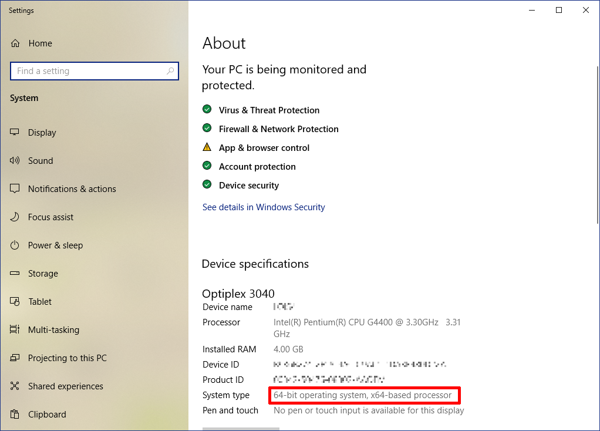

Under the section Device Specification you will find the heading System Type which will tell you if your computer is 64-bit or 32-bit.

*Windows 8:* 

Point to the lower-right corner of the screen, move the mouse pointer up, click **Settings**, and then click Change PC settings.

Select **PC and devices > PC info**.

Under the heading **PC** find the heading System Type which will tell you if your computer is 64-bit or 32-bit.

*Windows 7:* 

*Note: Microsoft no longer provides support and security updates for Windows 7 systems - this means these systems are potentially unprotected from being hacked.*

Press the Windows key, then type "Control Panel". From the list of possible options click on Control Panel.

When the Control Panel opens if there is an item called "System" then click on this. 

If there isn't an icon called "System" but there is a category called "System and Security" then click on this then click on "System" in the new display.

For Windows 7 the display will look like this:

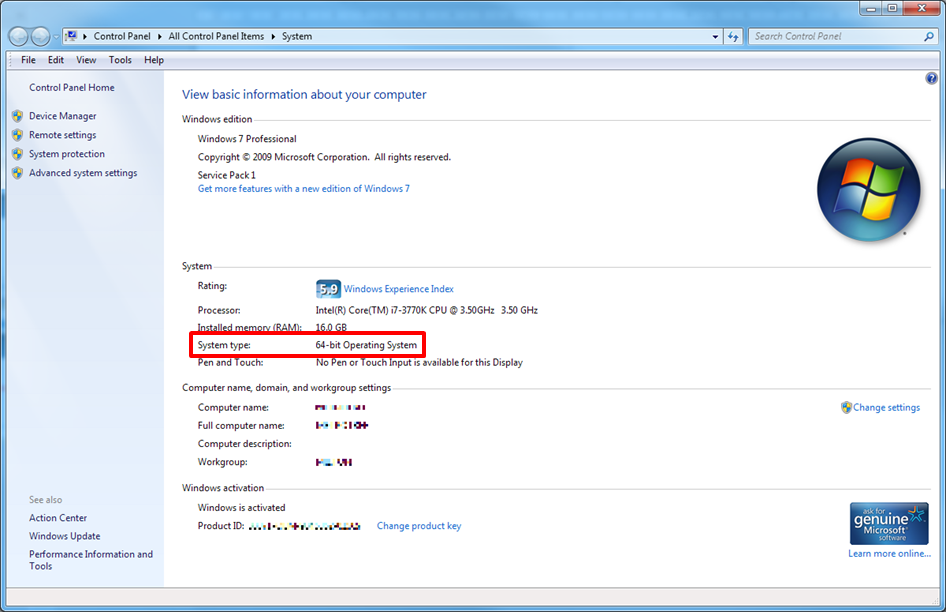

The item labelled "System type:" will show you whether your operating system is 32-bit or 64-bit.

## 2. Go to the *Python Releases for Windows* download web page

Click on the link below to go to the Python download page. If you right-click on the link you will have the option to open the Python downloads page in a new tab, and leave these instructions available to go back to.

[https://www.python.org/downloads/windows/](https://www.python.org/downloads/windows/)

Here is what the link looks like:

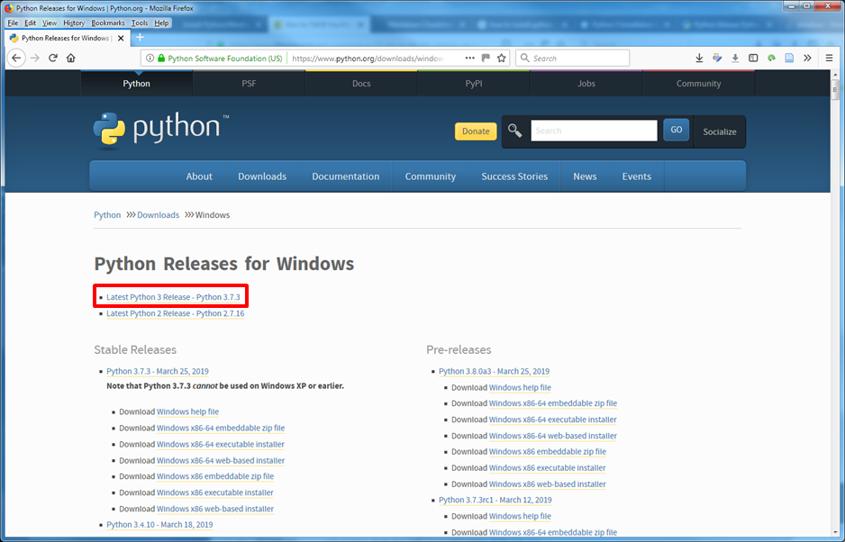

From the two options at the top of the page select the one called "Latest Python 3 Release". DO NOT select "Latest Python 2 Release"!! (The number of of the latest Python 3 release will be higher then 3.7.3.)

The link will go to a page which looks like this (again, the version number will be higher than 3.7.3):

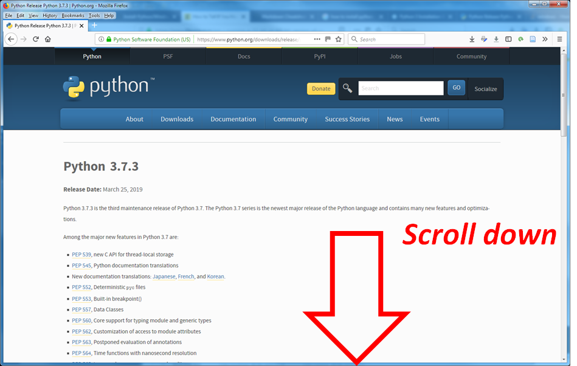

Scroll down until you find a section headed **Files**

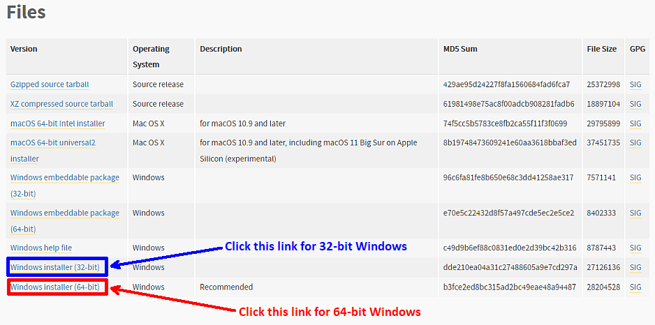

Click the file link depending on whether your operating system is 32-bit or 64-bit. The file will either start downloading straight away into your Downloads folder, or you may be asked where on your computer you want to save the file. Choose where to save it, then click OK.

## 3. Run the installation program

Open File Explorer (if you have Windows 8 or 10) or Windows Explorer (if you have Windows 7) and navigate to the place where the Python installation file has been saved. Double click on this file to start the installation.

You will probably see a *User Account Control* window like this:

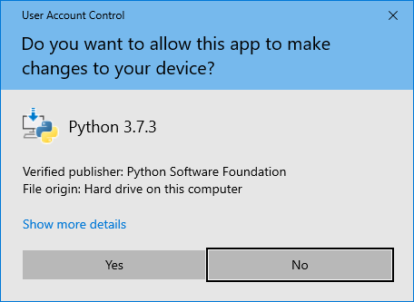

Click Yes. This will open the first Set up window:

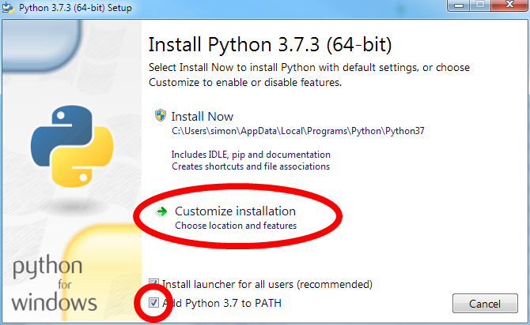

If there is a tick box at the bottom labelled "Add Python to PATH" then make sure there is a tick in the box. (This box may have been removed in later versions of Python.)

Then click on *Customize installation*. This will open the second Set up window:

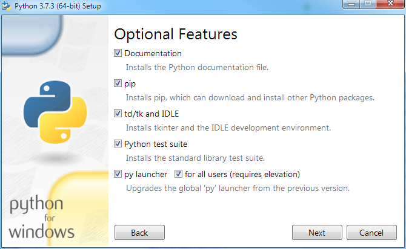

There is nothing to be changed on this page, so click Next to open the third Set up window:

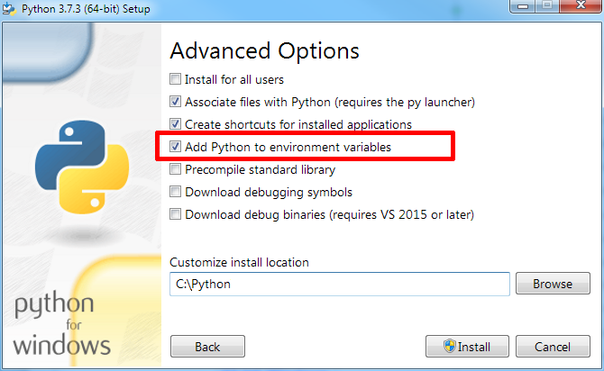

Check there is a tick in the box for "Add Python to environment variables".

When this window opens it will probably show the Customize install location as

```html
C:\Users\<your name>\AppData\Local\Programs\Python\Python37
```

(Note: if you are installing a later version than Python 3.7.3 then the number 37 will be a higher number.)

We strongly recommend changing this to ```C:\Python\Python```. This will make your Python installation more accessible to other Python extensions, like Pygame Zero.

(Note: if you are installing a later version of Python the number 37 should be replaced with a higher number.)

Once you have changed the install location click on Install. This will probably open another *User Account Control* window, like the one above.

Click on Yes to complete the Python installation. This may take a few minutes.

## 4. Open the Python IDLE editor

Once the installation is finished click on the Windows icon or press the Windows key on the keyboard. Type the word "Python" or "IDLE", and it should find a program called IDLE (with the Python version in brackets after it).

Click on this to open up the *Python Shell* window:

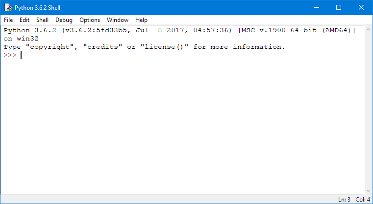

Click to open the File menu and choose New... 

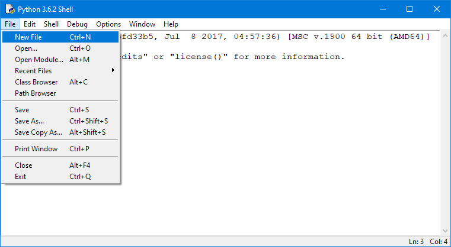

to open a blank Python programme window which will be called "Untitled". You can type your Python3 code in this window.

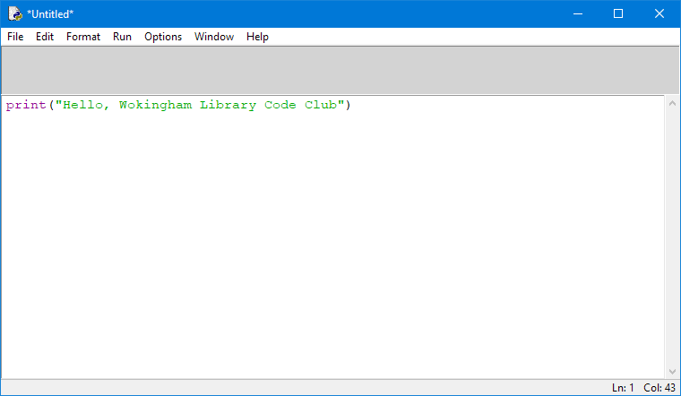

You need to *save* your code before you can test it. Do this by choosing the File menu and clicking Save As...

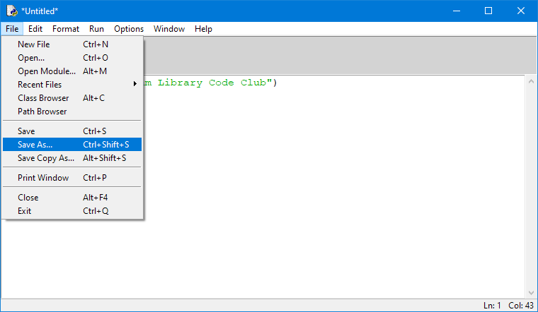

Once you've *saved* your code, which should be in a file which has the extension ```.py``` you can test it by choosing the Run menu and clicking Run Module

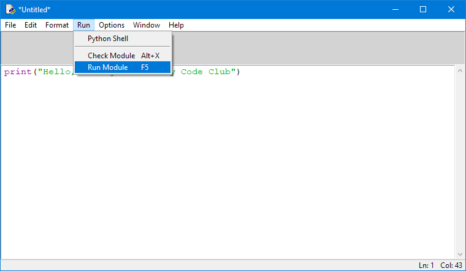

This example code will produce output in the Python shell.

You are now ready to start experimenting with Python3 coding!

## 5. Alternative Python editors

As stated at the start of this page the IDLE editor is very basic. One of the superior code editors is called *Visual Studio Code*, which is distributed for free by *Microsoft*. Here is a link to a page with instructions for adding *Visual Studio Code*:

* [Install Visual Studio Code](./Install-VSC/README.md)
