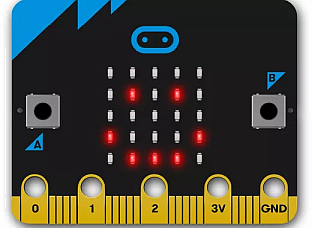
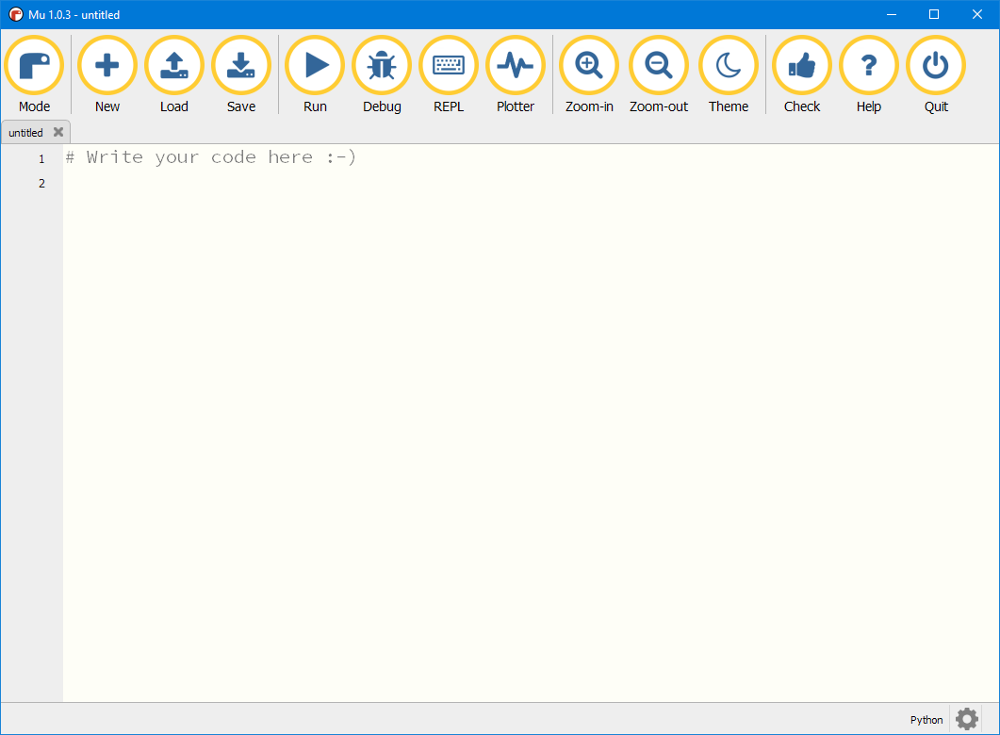
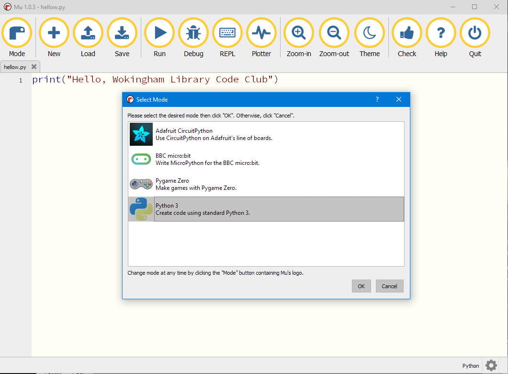
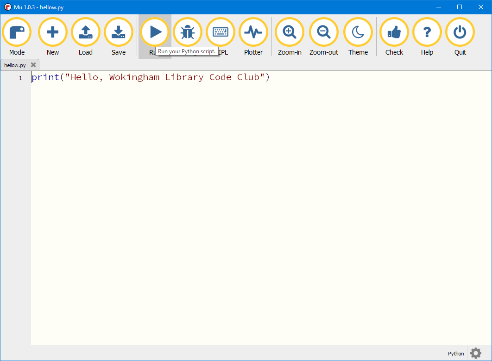
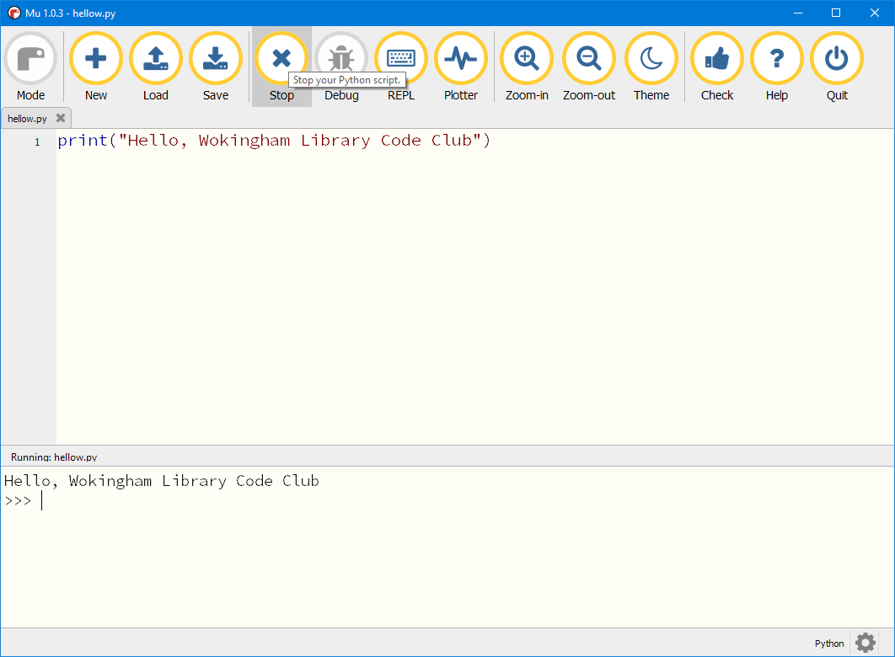

# The *mu* Python editor

## Installing *mu*

This is a very straightforward code editor to use. When you install the editor it puts Python3 on your system as part of the installation.

This editor not only lets you write normal Python code it also 

1. makes it very easy to write Python programmes for the BBC microbit microprocessor

2. provides a very easy way to run your Python code using the ***Pygame Zero*** Python extension

To obtain the installation file go to the programme webpage at [https://codewith.mu/](https://codewith.mu/) and click on the *Download* button.

You will see that there are versions of *mu* for Windows, MacOS and a portable version which lets you put the *mu* editor on a memory stick and use it on any computer you may be using.

Select the version for your system and look at the *Instructions* page for your version to see what to do.

If you are using Windows choose the 32-bit or 64-bit version depending on your operating system. (If you don't know which version you have then look at item 1 on the page [Windows full Python3 installation](../Windows-installation/Windows-full-installation/README.md)).

## Using *mu*

When you first open ***mu*** you will see this window:

The buttons across the top are the normal commands you usually see in Menus in Windows programmes.

One important button is the Mode button at the top left. When you click on that it gives you choices for the mode you want your Python code to run in:

The bottom option will enable you to write and run standard Python code. Other options enable you to programme the BBC microbit in Python, and to run programmes written with the Pygame Zero extension.

Type your Python code in the edit window, then Save your file, with a .py extension. You will see the tab above your code has now changed from *untitled* to show the name of your programme:

When you click on the Run button the code runs and the results are displayed in the results panel at the bottom:

## More information

The *mu* website [https://codewith.mu/en/tutorials/](https://codewith.mu/en/tutorials/) has lots of very helpful Tutorials on all topics related to this software

When you start writing more complex programmes you may need to use the **Debug** option to find any errors in your code. There is a tutorial here to show you how to do this.
