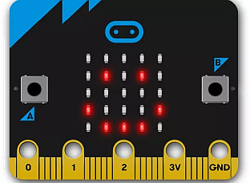

# Installing the *mu* Python editor

This is a very straightforward code editor to use. When you install the editor it puts Python3 on your system as part of the installation.

This editor not only lets you write normal Python code it also 

1. makes it very easy to write Python programmes for the BBC microbit microprocessor

2. provides a very easy way to run your Python code using the _**Pygame Zero**_ Python extension

To obtain the installation file go to the programme webpage at [https://codewith.mu/](https://codewith.mu/) and click on the *Download* button.

You will see that there are versions of *mu* for Windows, MacOS, Linux and a portable version which lets you put the *mu* editor on a memory stick and use it on any computer you may be using.

If you are using Windows choose the 32-bit or 64-bit version depending on your operating system. (If you don't know which version you have then look at item 1 on the page [Windows full Python3 installation](Windows-installation/README.md)).